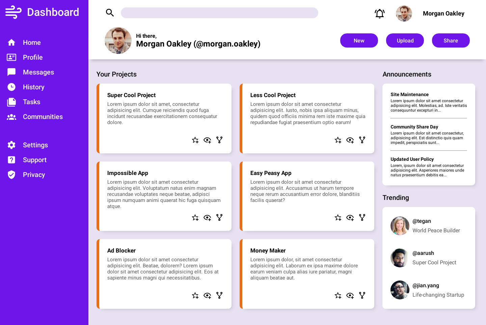

# odin-admin-dashboard

A Dashboard View Page based on The Odin Project's guidelines to practice intermediate HTML/CSS with a strong emphasis on CSS Grid.

This project was the synthesis of all the Intermediate HTML/CSS lessons I studied during the course. After making the [Holy Grail Web Layout](<https://en.wikipedia.org/wiki/Holy_grail_(web_design)#:~:text=The%20holy%20grail%20is%20a,available%20technologies%20all%20had%20drawbacks.>) with Flexbox, I am ecstatic to use Grid instead due to its simplicity and `grid-template-areas` and `grid-area` string value flexibility.

Using Flexbox with Grid allows for very simple layouts because of the accuracy of Grid and the flexible growth of elements to take up extra grid space thanks to Flexbox. I finally understood when to use `auto` `margin` for Flexbox children. It gives me more flexible in positioning my items in a container, notably the bottom-right side for my cards' buttons. `margin-top` basically forces the element to consume all extra space on top of it and pushes it to the bottom of the Flexbox container. `align-self: flex-end;` is used to push the element to the right side, achieving that bottom-right alignment.

```CSS
.projects__card__buttons {
  align-self: flex-end;
  margin-top: auto;
}
```

This was my biggest takeaway for bottom box shadows for that "floating header" effect. `box-shadow` allows us to manipulate the shadow's width with the 4th value right after the shadow's blur radius. This allows me to shrink the shadow's width to the center and since my horizontal offset was `0px` with the `12px` vertical offset towards the bottom, it makes the shadow only appear at the bottom of the container.

```CSS
nav {
  box-shadow: 0px 12px 8px -8px var(--primary-shadow);
  z-index: 1;
}
```

I'm still not sure when to use `repeat(auto-fit, minmax(<size>, 1fr)` though. I hope I can use it in the future other than these:

I need to improve on:

- Flexbox alignment in conjunction with Grid
- semantic HTML
- staying consistent with BEM CSS

# Output

### [Visit the Website Here](https://luzefiru.github.io/odin-admin-dashboard/)



# Requirements

These were the requirements in The Odin Project's [Project: Admin Dashboard](https://www.theodinproject.com/lessons/node-path-intermediate-html-and-css-admin-dashboard) site to serve as a guide for layout. Other aesthetic choices and implementations solely depend on the programmer.
